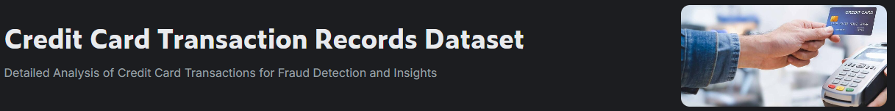

<h2>Credit Card Transaction Records</h2>

[Introduction](#instroduction)

[Description](#description)

[Objectives](#objetives)

[EDA](Analysis_EDA.ipynb)

[Model](model.ipynb)

[Conclusions/Insights](#conclusionsinsights)

### Instroduction

Over time, banking institutions have grown in terms of users and transactions, as well as in terms of competition, however, as payment methods and transactions are updated, so are criminals updated to the point of being cyber-criminals. In this case study, patterns in fraudulent transactions will be evaluated and findings will be found that can guide action to stakeholders

### Description

This dataset contains over 1.85 million records of credit card transactions, including details about transaction times, amounts, and personal and merchant information. It is designed to support various financial analyses and applications. 

### Objetives

- Fraud Detection: Implement machine learning models to identify fraudulent activities by analyzing patterns in transaction amounts, locations, and user profiles. Improve fraud detection systems by examining behavioral trends.
- Customer Segmentation: Group customers based on spending habits, location, and demographics. Customize marketing strategies and offers to different customer segments for enhanced engagement.
- Transaction Classification: Categorize transactions (e.g., groceries, entertainment) to gain insights into spending behaviors. Refine recommendation systems by understanding transaction preferences.
- Geospatial Analysis: Conduct geographical analysis to identify spending patterns and regional trends using latitude and longitude data.
- Predictive Modeling: Build models to predict future spending behaviors and detect potential fraud or financial trends based on historical data.
- Behavioral Analysis: Analyze factors such as transaction amount, merchant type, and time to understand spending behavior and the influence of demographics.
- Anomaly Detection: Identify unusual transaction patterns that deviate from normal behavior to spot potential fraud early. Use anomaly detection techniques to detect outliers and suspicious activities.

### Conclusions/Insights

- Women spend/spend on average less money, but they spend more frequently, therefore they are more likely to indulge in "ant-spending" 
- Fraud takes place mostly during off hours (from 10 pm to 3 am) and also at very high shopping traffic such as during the holiday season. 
- The money used in fraudulent transactions is not always a high amount, but also abnormally low amounts, probably with the intention of not generating instant suspicion.
- In general, states have expenses that seem essential, such as fuel, however there are states like Colorado that invest more in household products, food and clothing.
- Gas for transport is indispensable for the vast majority of the states, thus exceeding food expenditure.